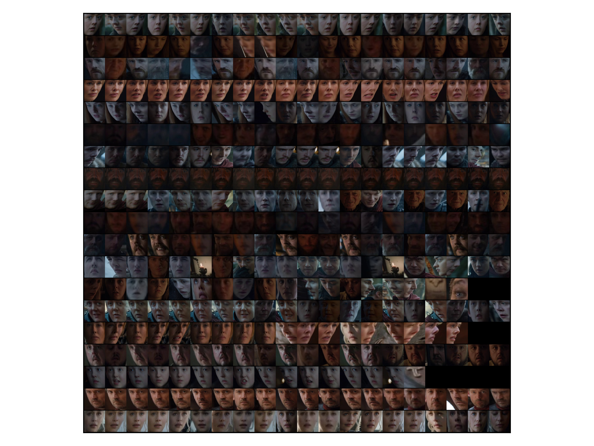

# weakvideo
This repo contains code to process a once live-streamed video and annotate it with Tweets.

# Instructions for Running Scene Segmentation
To set up PySceneDetect (detailed instructions can be found in their repo README):
```sh
pip install numpy
pip install opencv-python
git clone https://github.com/Breakthrough/PySceneDetect.git
cd PySceneDetect
python setup.py build
```

To extract scenes:
```sh
EPISODE=ep1
cd PySceneDetect
mkdir $EPISODE
cd $EPISODE
python ../scenedetect.py -i "/path/to/${EPISODE}.mov" -d content -t 30 -l -df 2 -si -co OUTPUT.csv -s STATS.csv
```

# Instructions for Running Face Detection
Install OpenFace by following the [instructions](https://cmusatyalab.github.io/openface/setup/) on their website. While OpenFace recommends using a Docker instance, I ended up installing it locally.

The script `code/extract_face_features.py` takes in a directory containing images, and extracts face vectors for each detectedface in each image. Below is an example of how to run it. Note that OpenFace does **not** support python3.
```sh
OPEN_FACE_ROOT=...
python2 extract_face_features.py \
--outputDir=/data/faces/output_dir \
--networkModel="${OPEN_FACE_ROOT}/models/openface/nn4.small2.v1.t7" \
--dlibFacePredictor="${OPEN_FACE_ROOT}/models/dlib/shape_predictor_68_face_landmarks.dat \
/data/faces/input_dir
```
In the output directory, you will find:
- `.jpg`s of the aligned face images extracted from each image in the input directory.
- `face_data.pkl` which contains the vector representations of each detected face. You can download an example of this [here](seas.upenn.edu/~daphnei/data/face_data.pkl).

# Clustering Faces
You must run `extract_face_features.py` first. Then you can run `cluster.py` in the following manner:
```sh
python cluster.py --inputFile=/path/to/face_data.pkl --numClusters=20
```

Nothing is done with the clustering results at the moment, except visualize them. You should get something like this:


# Files in this repo
- `data/ep{i}/CUTS.csv`: Contains the cuts computed by PySceneDetect for Episode i
- `data/ep{i}/STATS.csv`: Contains the mean color statistics for each frame in Episode i

# Useful Info

## Time Offsets
- Minute 1 of ep1 starts in cut 4
